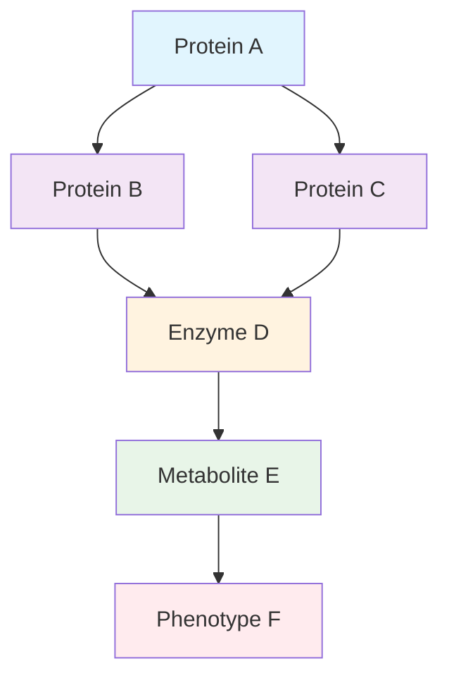

import DNAGenerator from './components/DNAGenerator.astro';
import ProteinViz from './components/ProteinViz.astro';


# The Future of Computational Biology

Welcome to my first blog post! This is a comprehensive test of all the amazing features we can use in MDX. Let's dive into the fascinating world where artificial intelligence meets biology.

## Mathematical Foundations

One of the most beautiful aspects of computational biology is how elegant mathematics can describe complex biological processes. Consider the classic Lotka-Volterra equations for predator-prey dynamics:

$$
\begin{align}
\frac{dx}{dt} &= \alpha x - \beta xy \\
\frac{dy}{dt} &= \delta xy - \gamma y
\end{align}
$$

Where $x$ represents prey population, $y$ represents predator population, and $\alpha, \beta, \gamma, \delta$ are positive real parameters.

For protein folding, we often work with the **Ramachandran equation**:

$$
E(\phi, \psi) = \sum_{i} V_i(\phi_i, \psi_i) + \sum_{i<j} U_{ij}(r_{ij})
$$

This energy function helps us understand the conformational space of proteins.

## Code Examples

Here's a simple Python implementation of a neural network for protein secondary structure prediction:

```python
import torch
import torch.nn as nn
import numpy as np

class ProteinStructureNet(nn.Module):
    def __init__(self, input_size=20, hidden_size=128, num_classes=3):
        super(ProteinStructureNet, self).__init__()
        self.lstm = nn.LSTM(input_size, hidden_size, batch_first=True, bidirectional=True)
        self.dropout = nn.Dropout(0.3)
        self.classifier = nn.Linear(hidden_size * 2, num_classes)
        
    def forward(self, x):
        # x shape: (batch_size, seq_len, input_size)
        lstm_out, _ = self.lstm(x)
        lstm_out = self.dropout(lstm_out)
        predictions = self.classifier(lstm_out)
        return predictions

# Example usage
model = ProteinStructureNet()
sequence = torch.randn(1, 100, 20)  # One protein of length 100
output = model(sequence)
print(f"Predicted structure: {output.shape}")  # (1, 100, 3)
```

And here's some JavaScript for interactive data visualization:

```javascript
// Interactive protein visualization using D3.js
const createProteinVisualization = (data) => {
  const svg = d3.select("#protein-viz")
    .append("svg")
    .attr("width", 800)
    .attr("height", 600);

  const simulation = d3.forceSimulation(data.nodes)
    .force("link", d3.forceLink(data.links).id(d => d.id))
    .force("charge", d3.forceManyBody().strength(-300))
    .force("center", d3.forceCenter(400, 300));

  // Add nodes (amino acids)
  svg.selectAll(".node")
    .data(data.nodes)
    .enter().append("circle")
    .attr("class", "node")
    .attr("r", d => d.importance * 5)
    .style("fill", d => colorScale(d.type));
};
```

## Interactive Widgets

Now for the fun part - actual interactive widgets you can play with! These demonstrate how computational biology tools might work in practice.

<DNAGenerator />

Let's also explore protein structures with this interactive visualizer:

<ProteinViz />

## Research Insights

> "The most beautiful thing we can experience is the mysterious. It is the source of all true art and science." - Albert Einstein

This quote perfectly captures the essence of computational biology. We're constantly uncovering the mysteries of life through the lens of computation.

### Key Areas of Focus

1. **Protein Structure Prediction**
   - AlphaFold has revolutionized this field
   - Deep learning approaches show incredible promise
   - Still challenges with membrane proteins and disordered regions

2. **Drug Discovery**
   - AI-driven target identification
   - Molecular property prediction
   - Clinical trial optimization

3. **Genomics & Personalized Medicine**
   - GWAS studies with ML enhancement
   - Polygenic risk scores
   - Pharmacogenomics applications

## Data Visualization

Here's an example of how we might visualize protein interaction networks:



## Image Example


*Caption: A beautiful representation of molecular structures - the building blocks of life.*

## Advanced Mathematics

For those interested in the mathematical foundations, here's the attention mechanism that powers transformer models in biology:

$$
\text{Attention}(Q, K, V) = \text{softmax}\left(\frac{QK^T}{\sqrt{d_k}}\right)V
$$

Where:
- $Q$ is the query matrix
- $K$ is the key matrix  
- $V$ is the value matrix
- $d_k$ is the dimension of the key vectors

This mechanism allows models to focus on relevant parts of protein sequences when making predictions.

## Code Syntax Highlighting

Let's test various languages:

```bash
# Bash script for bioinformatics pipeline
#!/bin/bash
for file in *.fasta; do
    blastp -query "$file" -db nr -outfmt 6 > "${file%.fasta}.blast"
done
```

```r
# R code for statistical analysis
library(ggplot2)
library(dplyr)

# Analyze gene expression data
expression_data %>%
  filter(padj < 0.05) %>%
  ggplot(aes(x = log2FoldChange, y = -log10(padj))) +
  geom_point(alpha = 0.6) +
  theme_minimal() +
  labs(title = "Volcano Plot of Differential Gene Expression")
```

## Conclusion

The intersection of AI and biology continues to yield fascinating insights. From protein folding to drug discovery, computational approaches are revolutionizing how we understand life itself.

Stay tuned for more posts exploring these exciting frontiers!

---

*Thanks for reading! Feel free to reach out with questions or comments.*